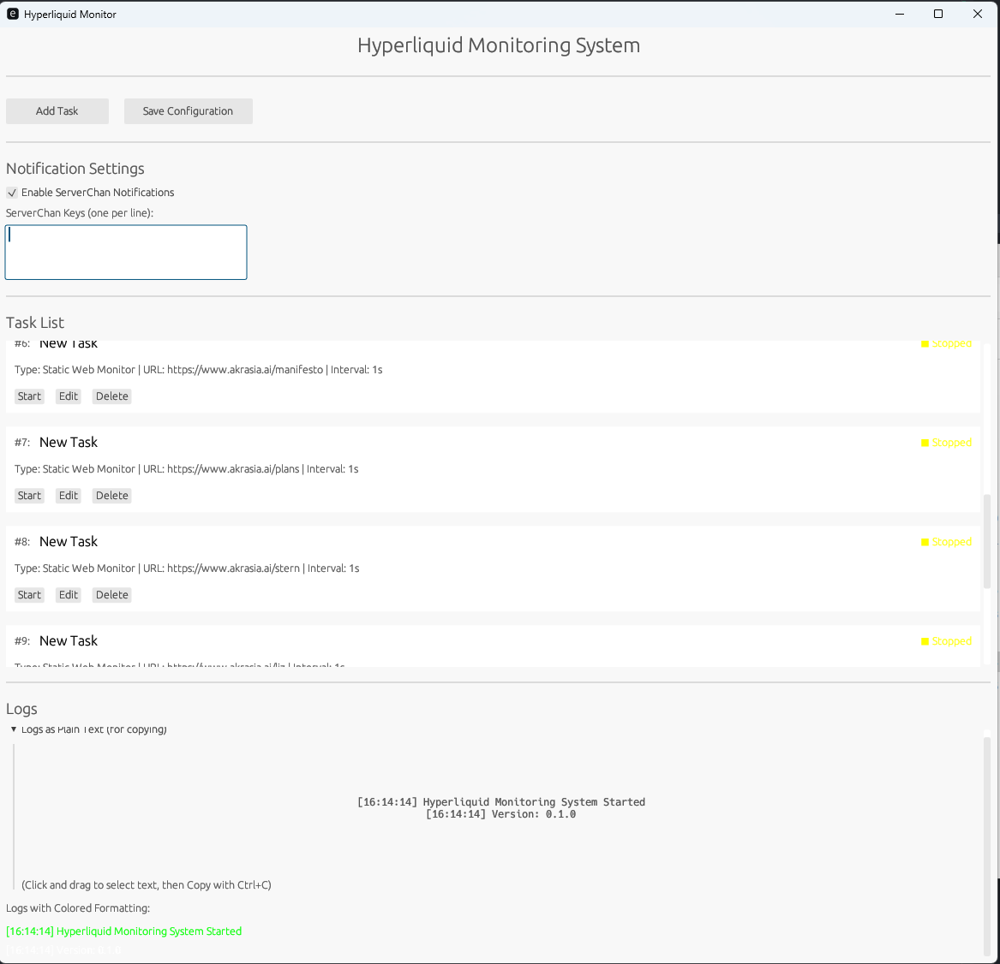
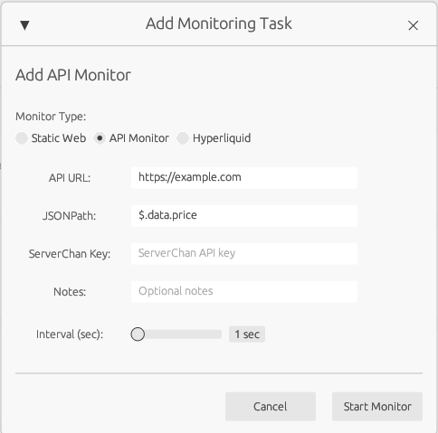
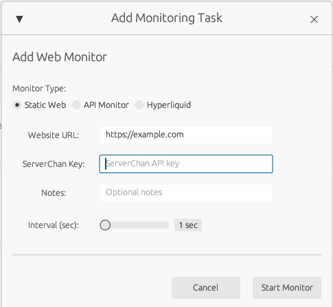
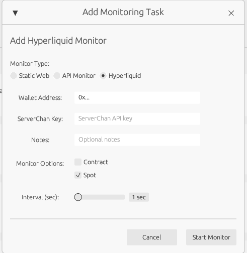
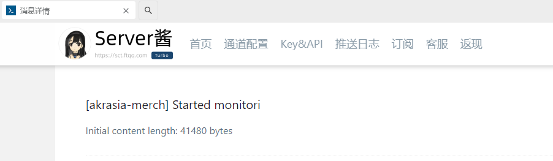
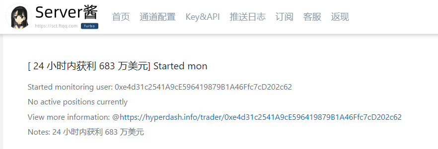

# Hyperliquid Monitoring System

A monitoring system developed based on Hyperliquid Rust SDK that can monitor website data changes, static webpage changes, and specific user trading activities.

该项目完成了对静态网页、指定url请求返回的json数据、hyperliquid用户（现货、转账、合约）交易活动的监控，能在1s内能通过方糖酱将监控信息传达给用户，并且提供了图形界面和非图形界面。












关于hyperliquid监控提示，在开启监控时，会自动先发送一遍当前监控对象的持有仓位情况，后续监控也会标明仓位的变化情况
About hyperliquid monitoring, when monitoring is turned on, the current monitored object's holding position will be automatically sent first, and subsequent monitoring will also indicate the position changes.




## Feature Overview

1. **API Data Monitoring**
   - Monitor data changes from REST API endpoints (JSON format)
   - Support for JSON path selectors to extract specific data fields
   - Customizable detection intervals and automatic change notifications

2. **Static Webpage Monitoring**
   - Monitor static webpage content changes
   - Support for monitoring specific HTML elements
   - Change comparison and difference display

3. **Hyperliquid User Transaction Monitoring**
   - Monitor spot trading of specified user addresses
   - Monitor contract trading of specified user addresses
   - Transaction history and statistics

4. **Notification Methods**
   - ServerChan push notifications, supporting WeChat receiving
   - Email notifications (optional)
   - Log file recording

5. **Graphical User Interface**
   - Full English interface for global users
   - Desktop application interface based on egui
   - Visual configuration of monitoring tasks
   - Real-time monitoring status and logs

## System Architecture

The system consists of the following modules:

1. **Data Collectors**:
   - API Data Collector: Gets JSON data from REST API endpoints
   - Webpage Content Collector: Gets static webpage content
   - Hyperliquid Transaction Collector: Gets user transaction data via API

2. **Data Processors**:
   - Change Detection: Compares data changes
   - Data Storage: Saves historical data for comparison

3. **Notification Service**: Sends detected changes to users through different channels

4. **Graphical Interface**: Provides a user-friendly operation interface with full English support

## Installation and Usage

### System Requirements

- Rust 1.69+
- Cargo 1.69+
- Stable network connection

### Installation Steps

1. Clone this repository
   ```bash
   git clone https://github.com/yourusername/hyperliquid-monitor.git
   cd hyperliquid-monitor
   ```

2. Configure environment variables
   Create a `.env` file in the project root directory and add the following content:
   ```
   # API Configuration
   HYPERLIQUID_BASE_URL=testnet  # or mainnet
   
   # Notification Configuration
   SERVER_CHAN_KEY=your_server_chan_key  # ServerChan push notification KEY
   ```

3. Compile the project
   ```bash
   cargo build --release
   ```

4. Running Methods

   **Command Line Mode**:
   ```bash
   cargo run --release -- --config config.yaml
   ```

   **Graphical Interface Mode**:
   ```bash
   cargo run --release --bin hyperliquid_monitor_gui
   ```

### Configuration File Explanation

Monitoring parameters and notification conditions can be set through the `config.yaml` configuration file. Below is a configuration example:

```yaml
api_monitor:
  targets:
    - url: "https://api-v2.solscan.io/v2/common/sol-market?tokenAddress=So11111111111111111111111111111111111111112"
      selector: "data.price"
      interval_seconds: 60
      
static_page_monitor:
  targets:
    - url: "https://example.com/page.html"
      selector: "#main-content"
      interval_seconds: 300
      
hyperliquid_monitor:
  addresses:
    - "0xc64cc00b46101bd40aa1c3121195e85c0b0918d8"
  interval_seconds: 120
  spot_trading: true
  contract_trading: true

notifications:
  server_chan:
    enabled: true
    interval_minutes: 5  # Minimum notification interval (minutes)
  email:
    enabled: false
```

## Usage Examples

### Using the Graphical Interface

After starting the GUI application, you can:

1. Add Monitoring Tasks
   - Click the "Add Task" button
   - Select the task type (API Monitor, Static Web Monitor, or Hyperliquid Monitor)
   - Fill in the relevant configuration
   - Click the "Add" button to save

2. Manage Monitoring Tasks
   - Start/Stop tasks
   - Edit task configurations
   - Delete tasks

3. Configure Notification Service
   - Set the ServerChan key in the "Notification Settings" area
   - Enable/Disable notifications

4. View Monitoring Logs
   - Real-time view of monitoring status in the log area at the bottom of the main interface

### Using Command Line

```bash
# Monitor API data
cargo run -- --monitor api --url "https://api-v2.solscan.io/v2/common/sol-market?tokenAddress=So11111111111111111111111111111111111111112" --selector "data.price"

# Monitor static webpage
cargo run -- --monitor static --url "https://example.com/announcement.html" --selector "#announcement-content"

# Monitor Hyperliquid user
cargo run -- --monitor hyperliquid --address "0xc64cc00b46101bd40aa1c3121195e85c0b0918d8"
```

### JSON Path Selector Examples

When monitoring API endpoints, you can use dot notation to extract specific data from JSON responses:

```
# Simple key access
"price"  # Extracts the value of the "price" field at the root level

# Nested object access
"data.price"  # Extracts the "price" field within the "data" object

# Deep nesting
"result.marketData.lastPrice"  # Navigates through multiple levels
```

## About ServerChan Notifications

This project uses the notification service provided by ServerChan, which supports pushing monitoring information to WeChat. Usage steps:

1. Register and get a ServerChan key
   - Visit https://sct.ftqq.com/ to register an account
   - Get the SENDKEY

2. Configure the key
   - Set `SERVER_CHAN_KEY` in the `.env` file
   - Or set it in the "Notification Settings" area of the GUI interface

## Recent Updates

- **Version 0.1.2 (2025-04-09)**
  - Removed JavaScript monitoring functionality
  - Improved static webpage monitoring
  - Enhanced API monitoring capabilities
  - Optimized performance

- **Version 0.1.1 (2025-04-09)**
  - Full English interface support for global users
  - Optimized code comments and documentation
  - Fixed notification formatting issues

## License

This project is licensed under the MIT License - see the [LICENSE](LICENSE) file for details.

## Acknowledgements

- [Hyperliquid Rust SDK](https://github.com/hyperliquid-dex/hyperliquid-rust-sdk) - Provides the basic SDK for API access
- [ServerChan](https://sct.ftqq.com/) - Provides push notification service
- [egui](https://github.com/emilk/egui) - Provides graphical interface library